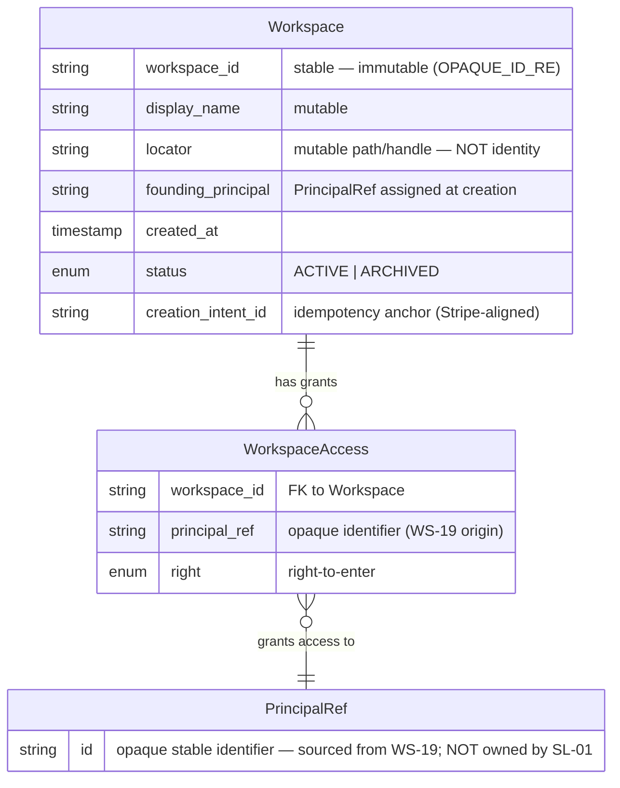
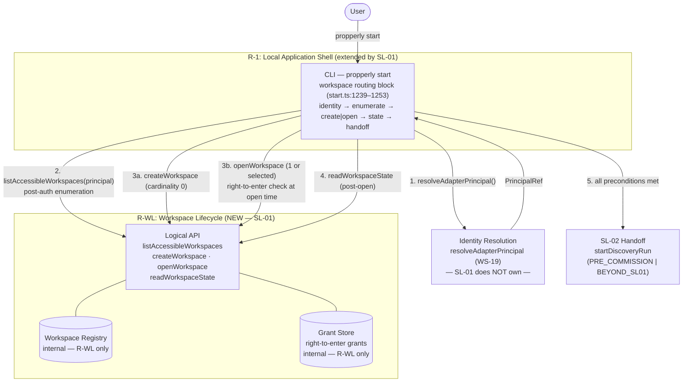
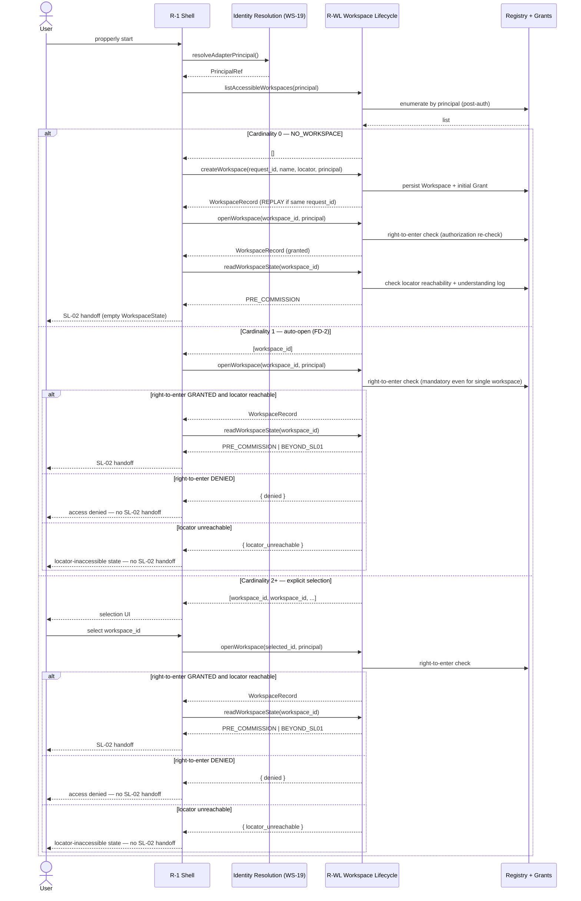

# SL-01 Workspace Setup — System Design

**Source:** `architecture/slices/sl-01-workspace-setup/SLICE_SYSTEM_DESIGN.md` V1 (2026-09-08)
**Status:** READY — GD-01 patch applied 2026-09-08

**GD-01 resolution note:** The three Phase 3 patch items are applied in this revision: (1) architecture component diagram — see §Component Diagram; (2) logical sequence diagram — see §Logical Sequence; (3) entity model relationship clarification — see §Entity Relationships. GD-01 is CLOSED for SL-01.

---

## §1 — Entity Model

### Workspace Entity (Logical)

```
Workspace
  workspace_id:         string     — stable, assigned at creation, immutable (OPAQUE_ID_RE)
  display_name:         string     — human-readable, mutable
  locator:              Locator    — deployment-specific path/handle, mutable (NOT identity)
  founding_principal:   PrincipalRef — the identity that created this workspace
  created_at:           Timestamp
  status:               ACTIVE | ARCHIVED
  creation_intent_id:   string     — idempotency key (CONFLICT semantic on mismatch)
```

**workspace_id is the sole stable identity.** Locator change does not change identity. Locator equivalence does not imply workspace identity equivalence.

### WorkspaceState Discriminator (3-way enum)

```
NO_WORKSPACE     — no workspace exists for this identity
PRE_COMMISSION   — workspace exists + locator reachable + understanding log absent
BEYOND_SL01      — workspace exists + locator reachable + understanding log present
```

WorkspaceState is a **derived projection** (not a persisted enum) derived from:
- Registry record existence → R-WL WorkspaceRegistry
- Locator reachability → `existsSync(normalizedLocator)` after `safeResolveWithin()`
- Understanding log existence → `existsSync(join(locator, LOG_FILE))`

**What SL-01 does NOT read:** The internal state of a DiscoveryRun, the contents of a SourceInventory, or the state of a ConfirmationReceipt. These are opaque to SL-01.

### PrincipalRef

An opaque stable identifier for the authenticated operator. Resolved before any workspace operation. Sourced from the existing WS-19 gateway (`resolveAdapterPrincipal`). SL-01 does NOT own identity resolution.

### Idempotency key

`creation_intent_id` (Stripe-aligned pattern). Same intent_id + SAME input → REPLAY (return existing). Same intent_id + MATERIALLY DIFFERENT input → CONFLICT (explicit error). Sibling precedent: `src/spike/source_approval.ts` uses `(request_id + payload hash)`.

### Entity relationships



**Relationship notes:**
- `WorkspaceState` is a **derived projection** in SL-01 — it is NOT a persisted entity. It is computed from Registry record existence + locator reachability + understanding log presence. It is not shown in the ER diagram because it has no durable row. *(Cross-slice note: SL-02's entity model treats WorkspaceState as a stored entity with `approved_inventory_ref` — that is the state SL-02 confirmation writes after SL-01 hands off. Both are semantically consistent: SL-01 derives routing state from what SL-02 will eventually persist.)*
- `WorkspaceAccess` is the grant record linking a PrincipalRef to a Workspace with a right-to-enter. It is the internal artifact of the Grant Store (R-WL internal).
- `PrincipalRef` is resolved externally (WS-19 `resolveAdapterPrincipal`). SL-01 does not own identity resolution — it consumes the resolved opaque identifier.
- **This is a logical model.** Physical schema, storage technology, table names, and file representation are Implementation Design decisions (OD-STORE, OD-GRANT — deferred).

---

## §2 — Logical Responsibilities

### R-1: Local Application Shell (EXISTING, extended by SL-01)

**What it owns:** CLI dispatch, HTTP host (`onboarding_server`), browser handoff, loopback security (CSRF, capability cookie, path containment). **SL-01 extension:** workspace routing block at `start.ts:1239–1253`.

**R-1 routing responsibilities (SL-01 extension):**
1. Call `R-WL.listAccessibleWorkspaces(principal)` — post-auth enumeration; result is a cardinality count, not a WorkspaceState enum
2. Cardinality 0 → call `R-WL.createWorkspace(request_id, name, locator, principal)` then `R-WL.openWorkspace(workspace_id, principal)` → proceed to commission
3. Cardinality 1 → call `R-WL.openWorkspace(workspace_id, principal)` — right-to-enter re-checked at open time (auto-open; FD-2)
4. Cardinality 2+ → selection UI → user selects one → call `R-WL.openWorkspace(selected_id, principal)` — right-to-enter re-checked at open time
5. `openWorkspace` returns `{ denied }` → access failure displayed; return to selection; no SL-02 handoff
6. `openWorkspace` returns `{ locator_unreachable }` → locator-inaccessible error; no SL-02 handoff (applies to all cardinalities, including single-workspace auto-open)
7. Successful `openWorkspace` → call `R-WL.readWorkspaceState(workspace_id)` → route to SL-02

**Naming note:** `canEnterWorkspace` is the authorization predicate *inside* `openWorkspace` — it is not a separate logical interface call. `MULTIPLE` and `LOCATOR_STALE` are routing conditions, not WorkspaceState enum values (SLICE_RECONCILIATION.md §152).

R-1 reads Workspace; R-1 does NOT write Workspace records. All Workspace writes go through R-WL.

**No new server. No new port. No new security layer.**

### R-WL: Workspace Lifecycle (NEW, introduced by SL-01)

**What it owns:** Workspace entity creation; durable workspace registry; accessible-workspace enumeration (post-authorization by construction); locator management; WorkspaceState derivation; authorization gateway.

| Logical interface | Signature |
|---|---|
| createWorkspace | `(request_id, display_name, locator, principal_ref) → WorkspaceRecord | Error` |
| listAccessibleWorkspaces | `(principal_ref) → WorkspaceId[]` — post-auth, may be empty |
| openWorkspace | `(workspace_id, principal_ref) → record | { denied } | { locator_unreachable }` |
| readWorkspaceState | `(workspace_id) → { discriminator: 'NO_WORKSPACE' | 'PRE_COMMISSION' | 'BEYOND_SL01' }` |

**R-WL invariants:**
- `workspace_id` assigned at creation and immutable; locator is a mutable attribute
- Enumeration is post-authorization by construction
- No Workspace is created without a confirmed operator identity
- Workspace records are never deleted by automated action

**Deferred to Implementation Design (OD-STORE, OD-GRANT, OD-U2):** storage technology, grant store persistence technology, idempotency hash mechanism. See RECONCILIATION.md.

**Implementation home:** `src/workspace/` (new module, separate from `src/spike/`)

---

## Component diagram



**Logical responsibilities do not imply separate processes or microservices.** Service/process decomposition is Yigal's Implementation Design task. R-WL executes where the registry and grant store are reachable; all others follow the deployment profile.

---

## Logical sequence — happy path and routing branches



**Sequence invariants:**
- `listAccessibleWorkspaces` is post-authorization by construction — enumeration result is already filtered to the caller's granted workspaces (Invariant 2 / §4).
- `openWorkspace` performs a mandatory right-to-enter re-check at open time for **all** cardinalities, including single-workspace auto-open (FD-2). "Authorization twice" is intentional (§4 Invariant 2).
- `locator_unreachable` is a possible return from `openWorkspace` regardless of cardinality — it appears in all three branches of the sequence.
- `createWorkspace` with the same `request_id` + same inputs → REPLAY (return existing record, no second Workspace created; Invariant 7 / S10).
- No SL-02 handoff occurs unless all preconditions met: identity resolved, openWorkspace returned a WorkspaceRecord (not denied or locator_unreachable), readWorkspaceState succeeded.

---

## §3 — 8 System Scenarios (A–H)

| Scenario | Trigger | Outcome |
|---|---|---|
| **A — First Run** | No workspace exists | R-WL creates workspace; state-aware dispatch routes to SL-02; empty WorkspaceState |
| **B — Re-Open (1 workspace)** | One accessible workspace; right-to-enter GRANTED | Auto-open (FD-2); right-to-enter re-checked at open time; routes to SL-02 |
| **C — Multiple Workspaces (2+)** | Two or more accessible workspaces | Explicit selection presented; right-to-enter re-checked for selected workspace; routes to SL-02 |
| **D — Admin-Provisioned** | Admin-created workspace accessible | Auto-open if exactly one; explicit selection if multiple; right-to-enter confirmed via ACL grant |
| **E — Right-to-Enter Denied** | Right-to-enter DENIED at open time | No SL-02 handoff; auth failure displayed; return to selection |
| **F — Locator Gone** | Workspace in registry; locator unreachable | Locator-inaccessible state surfaced; no SL-02 handoff; workspace record preserved |
| **G — Identity Unresolvable** | Authentication context ambiguous or unavailable | No workspace enumeration; no workspace open; clean error directed to auth resolution |
| **H — Restart / Resume** | App closed after workspace creation, before SL-02 committed state | Workspace record found in registry; WorkspaceState = PRE_COMMISSION; routes to SL-02 as if fresh |

---

## §4 — Invariants

1. **workspace_id is the sole stable identity.** Locator change does not change identity. Two workspace_ids at the same locator is an inconsistency — R-WL prevents this at creation time.
2. **Authorization twice.** Enumeration is post-authorization. Open-time re-check is mandatory even for single-workspace auto-open (FD-2). No workspace is opened without a passing right-to-enter check at open time.
3. **SL-01 fails closed.** No SL-02 handoff unless all preconditions met: identity resolved, right-to-enter GRANTED, locator reachable, WorkspaceState readable.
4. **SL-01 ends pre-commission.** The SL-01 ending state has a workspace but no commissioned run id and no SourceInventory.
5. **No content read before SL-02.** Metadata boundary (ADL-004) preserved throughout SL-01. No Source Access (R-2) occurs.
6. **R-WL writes Workspace records before SL-02 handoff.** Durability guarantee: restart recovers to an SL-02-ready state (Scenario H).

---

## §5 — Failure Modes

| Failure | SL-01 Response | Precondition for SL-02 handoff |
|---|---|---|
| F1: Identity resolution fails | Stop; display auth error; no workspace operation | No handoff |
| F2: Workspace Registry unavailable | Stop; display error; no enumeration | No handoff |
| F3: Right-to-enter denied at enumeration | Display zero/limited workspaces; offer creation if FD-1 | No handoff for denied workspace |
| F4: Right-to-enter revoked between sessions | Display auth failure; return to selection | No handoff |
| F5: Workspace locator unreachable | Display locator-inaccessible state; do not auto-delete Workspace record | No handoff |
| F6: WorkspaceState read error | Conservative fallback to NO_WORKSPACE; do not corrupt downstream state | No handoff |
| F7: Concurrent workspace creation conflict | Idempotency must prevent duplicate; return existing workspace_id if conflict detected | Only one workspace handed off |
| F8: Handoff preconditions not met | Treat as F1 or F3 | No handoff |

---

## §6 — System Acceptance Scenarios (S1–S10)

**S1 — First-run workspace creation:** Given no workspace exists, SL-01 presents creation flow; `workspace_id` is stable; handoff to SL-02 delivers empty WorkspaceState discriminator.

**S2 — Single workspace auto-open:** Given exactly one accessible workspace and confirmed right-to-enter, SL-01 auto-opens without selection prompt; routes to SL-02.

**S3 — Multiple workspace selection:** Given 2+ accessible workspaces, SL-01 presents selection list; after explicit selection, opens selected workspace and routes to SL-02.

**S4 — Pre-created workspace open:** Given one admin-created workspace accessible to the operator, SL-01 opens it and routes to SL-02.

**S5 — Right denied blocks entry:** Right-to-enter DENIED at open time; SL-01 does not hand off to SL-02.

**S6 — Locator unreachable blocks handoff:** Workspace in registry but locator unreachable; SL-01 does not hand off; customer informed.

**S7 — Identity unresolvable blocks all:** Identity resolution fails; SL-01 attempts no workspace enumeration or open.

**S8 — Restart recovers to SL-02-ready:** App closed after workspace creation but before SL-02 committed state; restart delivers same `workspace_id` to SL-02 with empty WorkspaceState.

**S9 — Handoff purity (negative assertion):** At the SL-02 handoff boundary, these entities do not exist for the handed-off workspace: Source, SourceCandidate, DiscoveryRun, SourceInventory, IdentityEvidence, CandidateDisposition, ConfirmationReceipt.

**S10 — Idempotent creation:** Duplicate creation requests with the same `request_id` return the same `workspace_id` without creating a second Workspace record.

---

## Engineering Inputs (Open Items)

**GD-01 — CLOSED 2026-09-08:**
- Component diagram: added (§Component Diagram)
- Logical sequence diagram (0/1/2+ routing): added (§Logical Sequence)
- Entity relationship clarification (Workspace / WorkspaceAccess / PrincipalRef): added (§1 Entity Relationships subsection)
- WorkspaceState cross-slice divergence with SL-02 documented (SL-01 = derived projection; SL-02 = stored entity with `approved_inventory_ref` — semantically consistent; see §1 Entity Relationships notes)

**CRQ-1 — `assertCanonicalRun()` extension (OPEN Engineering question):**
`launch_contract.ts:53` contains `assertCanonicalRun()` which guards `runId`. SL-01 ends pre-commission; no run id exists yet. Phase 6 confirms the insertion point (`start.ts:1239–1253`) is BEFORE `assertCanonicalRun` fires, and the guard requires no modification. However, the Integration Design must specify how `buildLaunchPlan()` receives the workspace_id and locator from SL-01 routing.

**OD-U2, OD-STORE, OD-GRANT — DEFERRED to Implementation Design:**
- OD-U2: Idempotency mechanism (hash strategy, comparison algorithm) — semantic frozen (CONFLICT), mechanism deferred
- OD-STORE: Registry persistence technology — JSON file or SQLite; ADL-005 constraint (no cloud-mandatory dependency)
- OD-GRANT: Grant store persistence technology — interface designed; technology not selected
