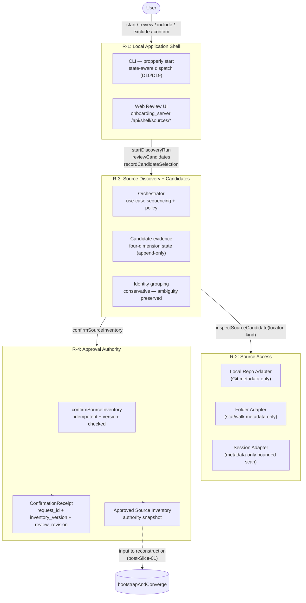
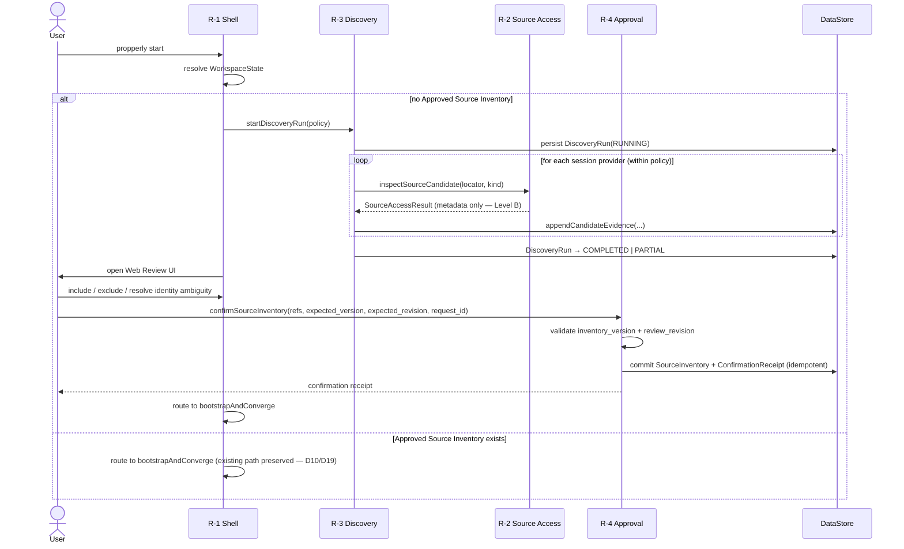
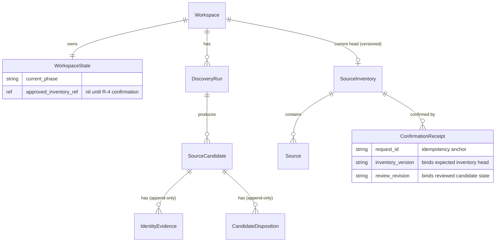

# SL-02 Source Discovery — System Design

**Canonical predecessor:** `architecture/slices/slice-01-source-discovery/system/SLICE_01_SOURCE_DISCOVERY_SYSTEM_V3_1.md`  
**Promotion candidate:** `architecture/promotion-candidates/sl-02-source-discovery/SYSTEM.md`  
**Status:** READY FOR HUMAN REVIEW — GD-01 patch applied 2026-09-08

**GD-01 resolution note:** The three Phase 3 patch items are applied in this revision: (1) architecture component diagram — see §Component Diagram; (2) logical sequence diagram — see §Logical Sequence; (3) entity model relationship clarification — see §Entity Relationships. GD-01 is CLOSED.

**Entity count delta from V3.1:** V3.1 §6 named 7 entities. This document uses the canonical 9-entity model (adds `ConfirmationReceipt` and `WorkspaceState`). The §Entity Relationships section below clarifies these additions and their logical relationships.

---

## Four logical responsibilities

These are logical boundaries, not microservices. Service/process decomposition is Yigal's Implementation Design task.

### R-1: Local Application Shell

**What it owns:** CLI dispatch, HTTP host (onboarding_server), browser handoff, loopback security (CSRF, capability cookie, path containment). SL-02 extends this with new API routes (`/api/shell/sources/*`) and a candidate review UI panel.

**No new server. No new port. No new security layer.**

### R-2: Source Access

**What it owns:** typed interface for accessing a source at a locator. Implementations for local repo (Git metadata), folder (stat/walk), and session-metadata. Does NOT own: discovery orchestration, candidate logic, approval.

**Interface:** `inspectSourceCandidate(locator, kind) → SourceAccessResult` — single typed seam; all Git/filesystem mechanics confined here.

### R-3: Source Discovery + Candidates

**What it owns:** DiscoveryRun lifecycle, four-dimension candidate model (availability, support, identity, selection), identity grouping, orchestration of R-2 adapters. Does NOT own: authorization.

**Selection is never automated.** The R-3 model records evidence and decisions; it does not set INCLUDED/EXCLUDED automatically.

### R-4: Approval Authority

**What it owns:** explicit human confirmation, Approved Source Inventory, idempotent confirmation with `inventory_version` + `review_revision` guards, optimistic concurrency check at confirmation time.

**INCLUDED ≠ Source creation.** The authority transition from candidate to Source occurs only at R-4 confirmation.

---

## Component diagram

**Logical responsibilities do not imply separate processes or microservices.** R-2 executes where the source is reachable. All others: placement follows deployment profile (V3.1 §13).

---

## Logical sequence — happy path

**Sequence invariants:**
- R-3 never calls `scanLocalRepoIntoWorld` — no semantic ingestion occurs before R-4 confirmation (Invariant 1).
- `confirmSourceInventory` is the sole authority transition; R-3's `INCLUDED` state is pre-authorization only (Invariant 2).
- State-aware dispatch at R-1 preserves the existing returning-user path (D10/D19, V3.1 §9).
- Retry of `confirmSourceInventory` with the same `request_id + inventory_version + review_revision` replays the committed result without a duplicate authority transition (Invariant 5).

---

## Entity model (9 entities)

| Entity | Responsibility | Key properties |
|---|---|---|
| **Workspace** | R-1 | PROPPERLY_HOME path, WorkspaceState ref |
| **WorkspaceState** | R-1 | Current phase, approved inventory ref *(GD-01 delta — added vs V3.1)* |
| **DiscoveryRun** | R-3 | run_id, policy snapshot, status, restart/resume state |
| **SourceCandidate** | R-3 | locator, four-dimension state (see below) |
| **IdentityEvidence** | R-3 | Append-only evidence log; feeds grouping decisions |
| **CandidateDisposition** | R-3 | Append-only decision log; selection (INCLUDED/EXCLUDED) |
| **Source** | R-4 | Authorized source identity; created only at confirmation |
| **SourceInventory** | R-4 | Versioned set of authorized Sources; append-only |
| **ConfirmationReceipt** | R-4 | Idempotency record; request_id, inventory_version, review_revision *(added vs V3.1 §6)* |

### Entity relationships

**Relationship notes:**
- `WorkspaceState` is R-1's state record; it drives the state-aware dispatch condition (D10/D19). Added vs V3.1 §6.
- `ConfirmationReceipt` is R-4's idempotency anchor; it binds `request_id + inventory_version + review_revision`. Added vs V3.1 §6.
- All other entity relationships mirror V3.1 §6 exactly.
- **This is a logical model.** Physical schema, storage technology, table names, and file representation are Implementation Design decisions (V3.1 §6.3, Appendix C — do not specify here).

---

## SourceCandidate four-dimension state

Each dimension is independent. No dimension may be inferred from another.

| Dimension | Values | Who sets it |
|---|---|---|
| **availability** | AVAILABLE / INACCESSIBLE / UNKNOWN | R-2 (source access check) |
| **support** | SUPPORTED / UNSUPPORTED / UNKNOWN | R-2 (format/kind check) |
| **identity** | RESOLVED / AMBIGUOUS / UNRESOLVED | R-3 (identity grouping) |
| **selection** | UNDECIDED / INCLUDED / EXCLUDED | **Human only** — never automated |

---

## System invariants

1. **No ingestion before authorization.** R-3 runs metadata-only inspection (Level B: no semantic scan). `scanLocalRepoIntoWorld` is post-approval (commissioning, R-4+) only.
2. **INCLUDED ≠ Source creation.** Selection in R-3 is pre-authorization. The authority transition occurs only at R-4 confirmation.
3. **Evidence is append-only.** `IdentityEvidence` and `CandidateDisposition` are append-only logs. Projection is deterministic and rebuildable from evidence alone; no projection-state file.
4. **Conservative identity default.** Ambiguity is preserved, never auto-resolved. Only explicit human identity operations change grouping.
5. **Confirmation is idempotent.** Same `request_id` + `inventory_version` + `review_revision` triple → same result, no duplicate.

---

## Architecture decision log (ADL-001 through ADL-005)

| ID | Decision | Scope | Status |
|---|---|---|---|
| **ADL-001** | A source's identity is determined by external identity evidence, not by its access locator. The locator is an access path; the source_id is the canonical identifier. These must not be conflated. | GLOBAL | ACCEPTED |
| **ADL-002** | All candidate state is represented as append-only evidence and decision logs. Deterministic projection is the only mutable view. No mutable candidate record. | CROSS_SLICE_CANDIDATE | ACCEPTED |
| **ADL-003** | When source identity cannot be resolved with confidence, the system preserves ambiguity (AMBIGUOUS). It does not auto-merge or auto-separate. Human resolution is required. | CROSS_SLICE_CANDIDATE | ACCEPTED |
| **ADL-004** | Source inspection during discovery is bounded at Level B: metadata and identity fields only. No semantic body scan, no content ingestion, no world-write. | SLICE_LOCAL | ACCEPTED |
| **ADL-005** | Source discovery and approval execute fully on-premise. No source identity, locator, or metadata is transmitted to a remote service during discovery or confirmation. | GLOBAL_CONSTRAINT | ACCEPTED |

---

## Engineering inputs for Phase 10 Implementation Design

These are open questions Yigal resolves in Phase 10. They are **not** blockers of the pre-handoff package — the semantic system design is complete and stable. They do block Phase 15 (Human Review gate) per ARCHITECTURE_WORKFLOW.md §3 and ORCHESTRATOR.md §4b.

| Input | Owner | Phase 10 Design Topic |
|---|---|---|
| **Q1 / B-02** — `launch_contract.ts` state-aware start | Architecture + Engineering | WHERE the inventory-presence check lives and HOW dispatch hooks into `launch_contract.ts`; product behavior (state-aware dispatch) already decided in D10/D19 and PRODUCT.md |
| **Q8 / B-03** — ACL permissions mapping | Architecture + Engineering | How enterprise policy upper bound connects to R-2/R-3/R-4; not a local-prototype blocker |
| **P6** — 8 pre-existing git boundary violations | Engineering | Requires boundary audit before GA |
| **CAP-08 (CAS)** — multi-process write safety for confirmation | Engineering | Must be addressed in Implementation Design; single-writer constraint is safe for local prototype |
| **B-08** — Web Review Interface | Design + Engineering | The only net-new UI component; no design artifact exists yet |

---

## Capabilities (summary — see PROOFS/README.md for full evidence)

| CAP | Capability | Status |
|---|---|---|
| CAP-01 | Local repository access | PROVEN |
| CAP-02 | Local folder access | PROVEN |
| CAP-03 | Application → Source Access contract | PROVEN |
| CAP-04 | Recent session discovery | PROVEN (local session-provider only) |
| CAP-05 | Conservative source identity | PROVEN with limits |
| CAP-06 | DiscoveryRun orchestration | PROVEN |
| CAP-07 | Candidate evidence and review | PROVEN |
| CAP-08 | Approval / inventory authority | PROVEN at single-writer semantic level; multi-process CAS unproven |
